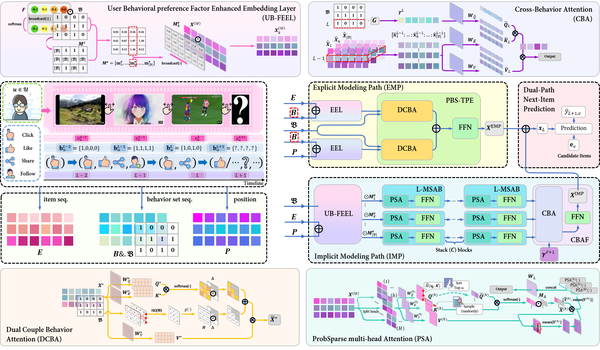

# EIDP
This is our official implementation for the paper **Explicit and Implicit Modeling via Dual-Path Transformer for Behavior Set-informed Sequential Recommendation**, accepted by **KDD'24**
* * *

## Behavior Set-informed Sequential Recommendation (BSSR) Illustration

* * *

## EIDP Architecture

* * *

## Requirements
python==3.7.1

pytorch==1.13.1

torchvision==0.14.1

CUDA 11.7
* * *

## Dataset
We use the dataset provided in **Tenrec: A Large-scale Multipurpose Benchmark Dataset for Recommender Systems (NeurIPS'22)**, sourced from the Tencent platform. For more information about the original data, please refer to [here](https://github.com/yuangh-x/2022-NIPS-Tenrec).

## Commands
Our implementation code is tested on Tesla V100 PCIE GPU Platform with 32 GB memory and has some references from the source codes of [ICLRec](https://github.com/salesforce/ICLRec) and [RecBole](https://github.com/RUCAIBox/RecBole).

For QK-Video, the execution command is,
```bash
python main.py --dataset=QKV
```

For QK-Article, the execution command is,
```bash
python main.py --dataset=QKA
```

For fast evaluation and results reproduction:
```bash
python main.py --dataset=[...] --do_eval
```
* * *

## Supplementary Materials
[A.1 Notation Table](A1NotationTable.pdf)

[A.2 ProbSparse multi-head self-attention mechanism](A2Algo_PSA.pdf)

[Main experimental results without loss function constraints](EIDP_onCE.pdf) (i.e., [DuoRec](https://github.com/RuihongQiu/DuoRec), [MGNN-SPred](https://github.com/Autumn945/MGNN-SPred) and [MBHT](https://github.com/yuh-yang/MBHT-KDD22) are all trained using the **CE** loss function, consistent with the original source code. Accordingly, EIDP also needs to maintain this consistency.) From this, it can be seen that training with the **CE** loss function leads to improvements in general models.

A fomulation of **CE** loss function:
```math
\mathcal{L}= -\frac{1}{|\delta(v)|}\sum_{u\in\mathcal{U}}\sum_{\ell=1}^{L}\delta(v^\ell_u)\frac{\exp(\hat{y}_{\ell+1, v^\ell_u})}{\sum_{j\in\mathcal{V}}\exp(\hat{y}_{\ell+1, j})}
```
where $v^\ell_u$ denotes the ground truth item and the indicator function $\delta(v^\ell_u)=0$ when $v^\ell_u$ is a padding item and $\delta(v^\ell_u)=1$ otherwise. Note that $|\delta(v)|$ represents the total amount of ground truth items.
* * *

If you have any issues or ideas, feel free to contact us ([2252271001@email.szu.edu.cn](mailto:2252271001@email.szu.edu.cn)).
